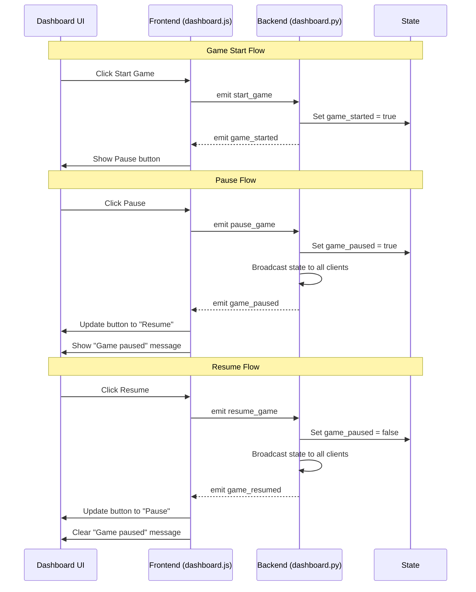

# Pause/Resume Game Functionality Implementation Plan

## Overview
Add ability to pause and resume the CHSH Game via a button in the dashboard interface. This will provide better game control and allow for temporary suspension of gameplay when needed.

## Implementation Details

### 1. Backend Changes

#### State Management (state.py)
- Add `game_paused` flag to AppState class
- Initialize flag to `False` in `__init__`
- Add reset of flag in `reset()` method

#### Socket Events (dashboard.py)
- Add `pause_game` event handler
  - Toggle game_paused state
  - Broadcast updated state to all clients
- Modify `emit_dashboard_full_update`
  - Include paused state in game_state object

### 2. Frontend Changes

#### HTML Changes (dashboard.html)
- Add Pause/Resume button in game control panel
- Position next to existing Start Game button
- Add status message area for "Game paused" state

#### CSS Styling (dashboard.css)
- Style pause button states (normal, hover, active)
- Add styles for paused game indication
- Ensure consistent styling with existing buttons

#### JavaScript Logic (dashboard.js)
- Add socket event handlers for pause/resume
- Implement UI state management
- Toggle button text between "Pause" and "Resume"
- Update status messages
- Block game actions while paused

### 3. UI/UX Workflow

### 4. Implementation Phases

1. **Backend Setup**
   - Add state management
   - Implement socket events
   - Test state transitions

2. **Frontend Base**
   - Add HTML elements
   - Implement basic styling
   - Add socket event handlers

3. **UI Polish**
   - Refine button states
   - Add transitions
   - Improve status messages

4. **Testing**
   - Verify pause/resume flow
   - Check state synchronization
   - Test error cases
   - Validate UI feedback

## Success Criteria

1. **Functionality**
   - Game can be paused and resumed
   - All clients receive pause state updates
   - Game actions blocked while paused

2. **User Experience**
   - Clear visual indication of pause state
   - Smooth transitions between states
   - Intuitive button behavior

3. **Technical**
   - State properly synchronized
   - No game state corruption
   - Clean error handling