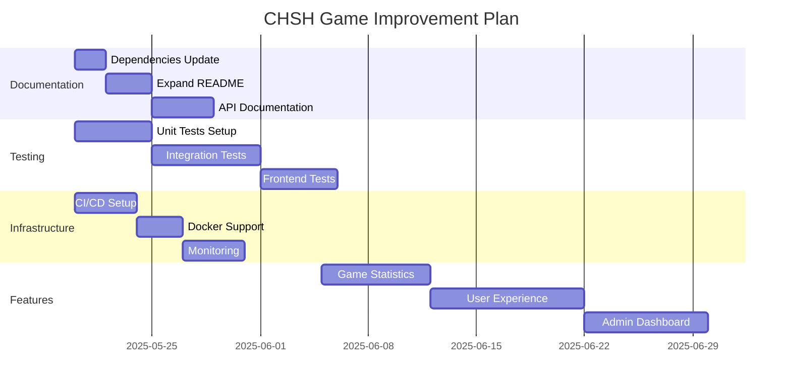

# CHSH Game - Code Review and Improvements

## Project Overview
The CHSH Game is a multiplayer web application implementing the Clauser-Horne-Shimony-Holt quantum experiment as an interactive game. The application uses:
- Flask backend with Socket.IO for real-time communication
- SQLAlchemy for database management
- Frontend built with vanilla JavaScript and Socket.IO client

## Current Implementation Analysis

### Strengths
1. Well-structured project organization with clear separation of concerns
2. Real-time gameplay using WebSocket communication
3. Team-based gameplay implementation with proper state management
4. Clean frontend design with responsive UI
5. Proper database session handling and error management

### Areas for Improvement

#### 0. Dependencies and Security
- **Dependency Updates**:
  - Update cryptography from 36.0.2 to latest version for security patches
  - Add dependency version pinning strategy
  - Implement dependency scanning in CI/CD
  - Regular security audits for dependencies
- **Dependencies Management**:
  - Add poetry or pipenv for better dependency management
  - Split requirements into dev/prod environments
  - Add dependency license compliance checking
  - Consider containerization to ensure consistent environments

#### 1. Documentation
- **README Enhancement**: Expand the README.md to include:
  - Detailed game rules and mechanics
  - Physics explanation of the CHSH experiment
  - Architecture overview
  - Development setup guide
  - API documentation
  - Deployment instructions for different environments

#### 2. Code Quality
- **Type Hints**: Add Python type hints throughout the codebase
- **Documentation Strings**: Add comprehensive docstrings to classes and functions
- **Constants File**: Create a dedicated constants.py file for game configuration
- **Error Handling**: Implement more specific error types and better error messages
- **Logging**: Replace print statements with proper logging

#### 3. Testing
- **Unit Tests**: Add comprehensive unit tests for:
  - Game logic
  - Socket event handlers
  - Database operations
- **Integration Tests**: Add tests for:
  - WebSocket communication
  - Team management flow
  - Game state transitions
- **Frontend Tests**: Implement JavaScript tests using Jest or similar

#### 4. Features
- **Game Statistics**:
  - Track and display team performance metrics
  - Historical game data visualization
  - Success rate analysis
- **User Experience**:
  - Add loading states for async operations
  - Improve error messages and user feedback
  - Add sound effects for game events
  - Implement tutorial/practice mode
- **Admin Dashboard**:
  - Enhanced monitoring capabilities
  - Game configuration interface
  - Real-time analytics

#### 5. Technical Improvements
- **State Management**:
  - Consider using Redis for distributed state
  - Implement better session handling
- **Security**:
  - Add rate limiting
  - Implement proper authentication
  - Add input validation
  - Security headers
- **Performance**:
  - Optimize database queries
  - Implement caching where appropriate
  - Add database indexing
- **Development Experience**:
  - Add Docker support
  - Implement hot reload for development
  - Add linting and formatting configuration

#### 6. Infrastructure
- **Monitoring**:
  - Add health check endpoints
  - Implement proper logging and monitoring
  - Error tracking (e.g., Sentry)
- **CI/CD**:
  - Setup GitHub Actions workflow
  - Automated testing
  - Deployment automation
- **Documentation**:
  - API documentation using OpenAPI/Swagger
  - Architecture diagrams
  - Deployment guides

## Priority Tasks

### High Priority
1. Update dependencies and security patches
2. Setup dependency management and scanning
3. Expand README documentation
4. Add comprehensive test suite
5. Implement proper logging
6. Add type hints
7. Setup CI/CD pipeline

### Medium Priority
1. Add game statistics features
2. Improve error handling
3. Implement caching
4. Add monitoring
5. Docker support

### Low Priority
1. Sound effects
2. Tutorial mode
3. Advanced analytics
4. Additional admin features

## Implementation Plan

## Next Steps
1. Review this improvement plan with the team
2. Prioritize tasks based on team capacity and project goals
3. Create detailed tickets for each improvement area
4. Setup project milestones and timeline
5. Begin with high-priority documentation and testing tasks