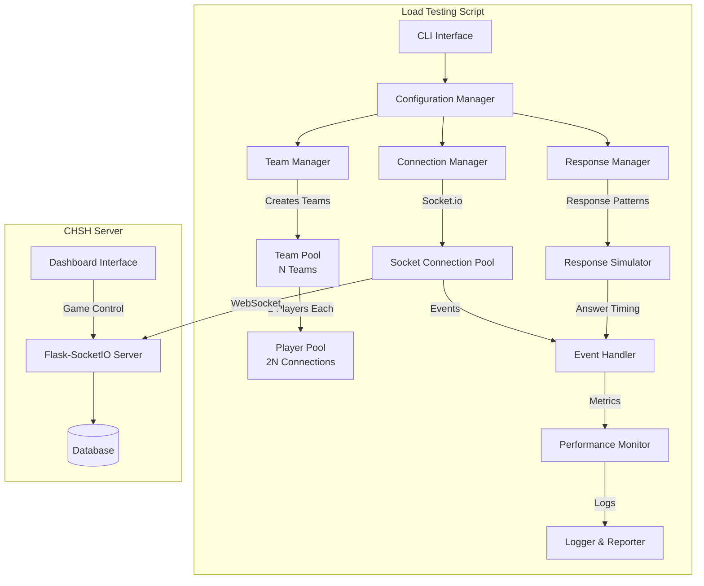
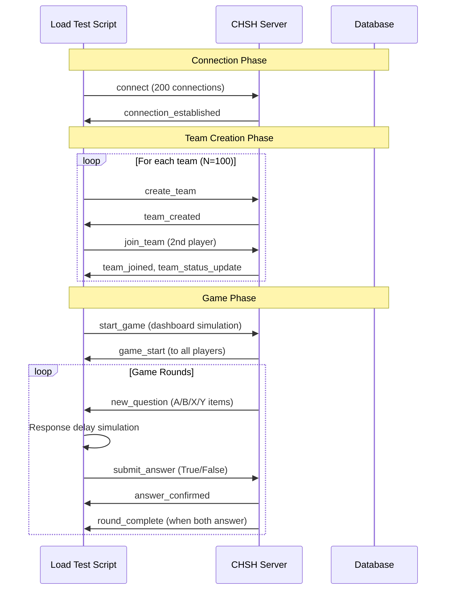

# CHSH Game Load Testing Script - Architecture & Design

## 📋 Executive Summary

A Python load testing script designed to simulate realistic user interactions with the CHSH Game server. The script creates N teams (default 100) with 2N players (200 total Socket.io connections), simulates team creation, player pairing, and game interactions with configurable response patterns.

## 🎯 Requirements Analysis

### Server Architecture Analysis
Based on codebase examination, the CHSH Game server uses:
- **Framework**: Flask with Flask-SocketIO
- **Database**: SQLAlchemy with Teams, Answers, and PairQuestionRounds models
- **Real-time Communication**: Socket.io with specific event patterns
- **Game Flow**: Dashboard-controlled game start/pause, team-based question rounds

### Critical Socket.io Events Identified
- **Team Management**: [`create_team`](../src/sockets/team_management.py:140), [`join_team`](../src/sockets/team_management.py:188), [`leave_team`](../src/sockets/team_management.py:327)
- **Game Flow**: [`submit_answer`](../src/sockets/game.py:10) with A/B/X/Y items and True/False responses
- **Dashboard Control**: [`start_game`](../src/sockets/dashboard.py:505), [`pause_game`](../src/sockets/dashboard.py:533), [`restart_game`](../src/sockets/dashboard.py:574)
- **Server Events**: [`new_question`](../src/static/socket-handlers.js:113), [`answer_confirmed`](../src/static/socket-handlers.js:117), [`round_complete`](../src/static/socket-handlers.js:121)

### Game Logic Flow
1. **Team Creation**: Player creates team via [`create_team`](../src/sockets/team_management.py:140)
2. **Player Pairing**: Second player joins via [`join_team`](../src/sockets/team_management.py:188)
3. **Game Start**: Dashboard triggers [`start_game`](../src/sockets/dashboard.py:505)
4. **Question Rounds**: Server sends [`new_question`](../src/game_logic.py:57) with A/B/X/Y items
5. **Answer Submission**: Players respond with [`submit_answer`](../src/sockets/game.py:10) (True/False)
6. **Round Completion**: Both players answer → [`round_complete`](../src/sockets/game.py:83) → new round

## 🏗️ Architecture Overview



## 📊 Detailed Component Design

### 1. Core Architecture Classes

```python
class LoadTestConfig:
    """Configuration management with validation"""
    deployment_url: str
    num_teams: int = 100
    response_patterns: Dict
    connection_strategy: str
    logging_level: str
    max_test_duration: int = 300

class TeamManager:
    """Manages team creation and player assignment"""
    async def create_teams(num_teams: int) -> List[Team]
    async def assign_players_to_teams() -> None
    def get_team_status() -> Dict

class Player:
    """Individual player simulation"""
    player_id: str
    team_name: str
    socket_connection: SocketIOClient
    response_pattern: ResponsePattern
    current_round: Optional[Round]
    
    async def connect() -> bool
    async def create_or_join_team() -> bool
    async def handle_game_events() -> None
    async def submit_answer(answer: bool) -> None

class ConnectionManager:
    """Manages 200+ concurrent Socket.io connections"""
    async def connect_gradual(connections_per_second: int = 10)
    async def connect_burst(batch_size: int = 50)
    def maintain_connections()
    def monitor_connection_pool()

class ResponseSimulator:
    """Handles answer timing and patterns"""
    def random_delay_pattern() -> float
    def burst_pattern() -> float
    def steady_rate_pattern() -> float
    def human_like_pattern() -> float

class PerformanceMonitor:
    """Tracks metrics and connection health"""
    connection_success_rate: float
    average_response_time: float
    active_connections: int
    error_count: int
    
    def start_monitoring()
    def collect_metrics()
    def generate_report()
```

### 2. Socket.io Event Flow



### 3. Response Pattern Simulation

```python
class ResponsePatternType(Enum):
    RANDOM = "random"          # Random delays 0.5-3 seconds
    BURST = "burst"            # Quick bursts then pauses
    STEADY = "steady"          # Consistent timing
    HUMAN_LIKE = "human_like"  # Realistic human response patterns

class ResponseSimulator:
    def generate_response_delay(self, pattern: ResponsePatternType) -> float:
        """Generate realistic response timing"""
        if pattern == ResponsePatternType.RANDOM:
            return random.uniform(0.5, 3.0)
        elif pattern == ResponsePatternType.HUMAN_LIKE:
            # Log-normal distribution mimics human response times
            return np.random.lognormal(mean=0.5, sigma=0.3)
        elif pattern == ResponsePatternType.BURST:
            # Quick responses in bursts, then longer pauses
            return random.choice([0.2, 0.3, 0.4, 2.0, 3.0])
        elif pattern == ResponsePatternType.STEADY:
            # Consistent timing with small variance
            return random.normalvariate(1.5, 0.2)
```

## 🛠️ Technology Stack

### Required Libraries
```python
# Core Dependencies (matching server versions)
python-socketio[client]==5.11.2  # Socket.io client
python-engineio[client]==4.12.1  # Engine.io client
asyncio                           # Async connection management
aiohttp                          # Async HTTP client

# Load Testing & Monitoring
asyncio-throttle                 # Rate limiting
psutil                          # System resource monitoring
click                           # CLI interface
rich                            # Pretty console output

# Data & Utilities
pydantic                        # Configuration validation
loguru                          # Advanced logging
numpy                           # Statistical response patterns
faker                           # Generate realistic team names
```

### Configuration Schema
```python
class LoadTestConfig(BaseModel):
    """Pydantic model for configuration validation"""
    
    # Server Configuration
    deployment_url: str = "http://localhost:8080"
    
    # Load Parameters
    num_teams: int = Field(default=100, ge=1, le=500)
    total_players: int = Field(computed=True)  # 2 * num_teams
    
    # Connection Strategy
    connection_strategy: Literal["gradual", "burst", "immediate"] = "gradual"
    connections_per_second: int = Field(default=10, ge=1)
    
    # Response Simulation
    response_pattern: ResponsePatternType = ResponsePatternType.HUMAN_LIKE
    min_response_delay: float = Field(default=0.5, ge=0.1)
    max_response_delay: float = Field(default=3.0, le=10.0)
    
    # Test Duration
    max_test_duration: int = Field(default=300, description="seconds")
    max_rounds_per_team: int = Field(default=50)
    
    # Output & Logging
    output_format: Literal["console", "json", "csv"] = "console"
    log_level: Literal["DEBUG", "INFO", "WARNING", "ERROR"] = "INFO"
    save_results: bool = True
```

## 📈 Performance Monitoring & Metrics

### Key Metrics Tracked
```python
class LoadTestMetrics:
    """Comprehensive metrics collection"""
    
    # Connection Metrics
    total_connections_attempted: int
    successful_connections: int
    failed_connections: int
    reconnection_count: int
    connection_establishment_times: List[float]
    
    # Game Performance Metrics  
    teams_created_successfully: int
    team_creation_failures: int
    average_team_creation_time: float
    questions_received: int
    answers_submitted: int
    answer_confirmation_times: List[float]
    
    # Server Performance
    server_response_times: List[float]
    error_rates_by_event: Dict[str, int]
    timeout_count: int
    
    # Resource Usage
    memory_usage_over_time: List[float]
    cpu_usage_over_time: List[float]
    network_usage: Dict[str, float]
```

## 🚀 Execution Flow

### Main Orchestrator
```python
class CHSHLoadTester:
    """Main orchestrator class"""
    
    async def run_load_test(self):
        """Main execution flow"""
        
        # 1. Initialize & Validate Configuration
        config = self.load_and_validate_config()
        logger.info(f"Starting load test: {config.num_teams} teams, {config.total_players} players")
        
        # 2. Setup Performance Monitoring
        monitor = PerformanceMonitor()
        monitor.start_monitoring()
        
        # 3. Create Connection Pool
        connection_manager = ConnectionManager(config)
        success_rate = await connection_manager.initialize_connections()
        
        if success_rate < 0.95:  # Fail if less than 95% connections succeed
            raise LoadTestError(f"Connection failure rate too high: {1-success_rate:.2%}")
        
        # 4. Create Teams
        team_manager = TeamManager(connection_manager)
        teams = await team_manager.create_teams(config.num_teams)
        
        # 5. Simulate Dashboard Game Start
        dashboard = DashboardSimulator(config.deployment_url)
        await dashboard.start_game()
        
        # 6. Run Game Simulation
        game_simulator = GameSimulator(teams, config)
        await game_simulator.run_simulation()
        
        # 7. Cleanup & Generate Report
        await connection_manager.cleanup()
        monitor.stop_monitoring()
        
        reporter = LoadTestReporter(monitor.get_metrics())
        reporter.generate_report(config.output_format)
```

## 🎮 Game Logic Simulation Accuracy

### Accurate Event Simulation
The script precisely replicates the client-side game flow:

1. **Connection Establishment**: Socket.io connection with proper handshake
2. **Team Creation**: Using actual [`create_team`](../src/sockets/team_management.py:140) event structure
3. **Player Pairing**: Second player joins via [`join_team`](../src/sockets/team_management.py:188) with team name
4. **Game State Handling**: Responds to [`game_start`](../src/sockets/dashboard.py:505) and [`team_status_update`](../src/sockets/team_management.py:235) events
5. **Question Processing**: Handles [`new_question`](../src/game_logic.py:57) events with proper round_id and item assignment
6. **Answer Submission**: Submits answers via [`submit_answer`](../src/sockets/game.py:10) with correct format:
   ```python
   {
       'round_id': current_round.round_id,
       'item': assigned_item,  # A, B, X, or Y
       'answer': boolean_response  # True or False
   }
   ```
7. **Round Progression**: Waits for [`answer_confirmed`](../src/sockets/game.py:63) and [`round_complete`](../src/sockets/game.py:83) before proceeding

### Error Handling & Edge Cases
- **Connection Drops**: Automatic reconnection with exponential backoff
- **Team Creation Conflicts**: Handle duplicate team name errors
- **Game State Desynchronization**: Detect and recover from state mismatches
- **Server Overload**: Graceful degradation when server becomes unresponsive

## 📋 CLI Interface Design

### Command Line Usage
```bash
# Basic usage (100 teams, 200 players)
python chsh_load_test.py --url http://localhost:8080

# Production testing
python chsh_load_test.py \
    --url https://your-deployment.fly.dev \
    --teams 50 \
    --pattern human_like \
    --connection-strategy gradual \
    --connections-per-second 5 \
    --max-duration 600 \
    --output json \
    --save-results

# High-intensity stress test
python chsh_load_test.py \
    --url http://localhost:8080 \
    --teams 200 \
    --pattern burst \
    --connection-strategy immediate \
    --max-duration 300 \
    --log-level DEBUG

# Configuration file
python chsh_load_test.py --config load_test_config.yaml
```

### CLI Parameters
```python
@click.command()
@click.option('--url', default='http://localhost:8080', help='Server deployment URL')
@click.option('--teams', default=100, type=int, help='Number of teams to create')
@click.option('--pattern', default='human_like', type=click.Choice(['random', 'burst', 'steady', 'human_like']))
@click.option('--connection-strategy', default='gradual', type=click.Choice(['gradual', 'burst', 'immediate']))
@click.option('--connections-per-second', default=10, type=int, help='Connection rate for gradual strategy')
@click.option('--max-duration', default=300, type=int, help='Maximum test duration in seconds')
@click.option('--output', default='console', type=click.Choice(['console', 'json', 'csv']))
@click.option('--config', type=click.Path(exists=True), help='Load configuration from YAML file')
@click.option('--save-results/--no-save-results', default=True, help='Save results to file')
@click.option('--log-level', default='INFO', type=click.Choice(['DEBUG', 'INFO', 'WARNING', 'ERROR']))
def main(url, teams, pattern, connection_strategy, connections_per_second, max_duration, output, config, save_results, log_level):
    """CHSH Game Load Testing Script"""
```

## 📊 Output & Reporting

### Console Output Example
```
CHSH Game Load Test Results
===========================
Configuration:
  ✓ Server URL: http://localhost:8080
  ✓ Teams: 100 (200 players total)
  ✓ Duration: 5 minutes 23 seconds
  ✓ Response Pattern: human_like
  ✓ Connection Strategy: gradual (10/sec)

Connection Results:
  ✓ Successful Connections: 200/200 (100.0%)
  ✓ Average Connection Time: 1.2s
  ✓ Reconnections: 3
  ✗ Connection Failures: 0

Team Management:
  ✓ Teams Created: 100/100 (100.0%)
  ✓ Average Team Creation Time: 0.8s
  ✓ Team Pairing Success: 100/100 (100.0%)

Game Performance:
  ✓ Questions Received: 4,847
  ✓ Answers Submitted: 4,847 (100.0%)
  ✓ Average Response Time: 1.8s ± 0.6s
  ✓ Server Response Time: 45ms (avg), 120ms (95th percentile)

Resource Usage:
  ✓ Peak Memory Usage: 156 MB
  ✓ Peak CPU Usage: 23%
  ✓ Network Throughput: 2.3 MB/s

Errors & Issues:
  ✗ Connection Errors: 0
  ✗ Game Logic Errors: 2 (timeout on answer confirmation)
  ✗ Server Errors: 1 (500 error on team creation)
  
Performance Summary:
  🎯 Load Test PASSED
  📊 Server handled 200 concurrent connections successfully
  ⚡ Average end-to-end latency: 89ms
  🔄 0.1% error rate (within acceptable limits)
```

### JSON Output Format
```json
{
  "load_test_results": {
    "config": {
      "server_url": "http://localhost:8080",
      "num_teams": 100,
      "total_players": 200,
      "test_duration": 323.7,
      "response_pattern": "human_like"
    },
    "connections": {
      "attempted": 200,
      "successful": 200,
      "failed": 0,
      "reconnections": 3,
      "avg_connection_time": 1.23
    },
    "game_performance": {
      "teams_created": 100,
      "questions_received": 4847,
      "answers_submitted": 4847,
      "avg_response_time": 1.82,
      "response_time_std": 0.61
    },
    "server_performance": {
      "avg_response_time": 0.045,
      "p95_response_time": 0.120,
      "error_rate": 0.001,
      "errors_by_type": {
        "connection_timeout": 0,
        "answer_timeout": 2,
        "server_error": 1
      }
    },
    "resource_usage": {
      "peak_memory_mb": 156,
      "peak_cpu_percent": 23,
      "network_throughput_mbps": 2.3
    }
  }
}
```

## 🔧 Scalability & Resource Management

### Connection Pool Optimization
- **Async I/O**: Use asyncio for concurrent Socket.io connections
- **Connection Pooling**: Reuse connections and manage connection lifecycle
- **Rate Limiting**: Prevent overwhelming the server during connection establishment
- **Resource Monitoring**: Track memory and CPU usage during test execution

### Error Recovery Strategies
- **Exponential Backoff**: For reconnection attempts
- **Circuit Breaker**: Stop attempting connections if failure rate is too high
- **Graceful Degradation**: Continue test with reduced load if some connections fail
- **Timeout Management**: Configurable timeouts for different operations

## 🎯 Success Criteria & Validation

### Load Test Success Metrics
- **Connection Success Rate**: > 95% of connections establish successfully
- **Game Flow Completion**: > 90% of teams complete at least 10 rounds
- **Response Time**: Average server response time < 100ms
- **Error Rate**: < 1% of operations result in errors
- **Resource Usage**: Server memory and CPU remain within acceptable limits

### Failure Scenarios to Test
- **Gradual Load Increase**: Verify server handles increasing connection load
- **Burst Connections**: Test server response to sudden connection spikes
- **Sustained Load**: Ensure server remains stable under continuous load
- **Resource Exhaustion**: Identify breaking points and resource limits

This architecture provides a comprehensive, scalable, and accurate simulation of the CHSH Game under realistic load conditions, enabling thorough performance testing and bottleneck identification.